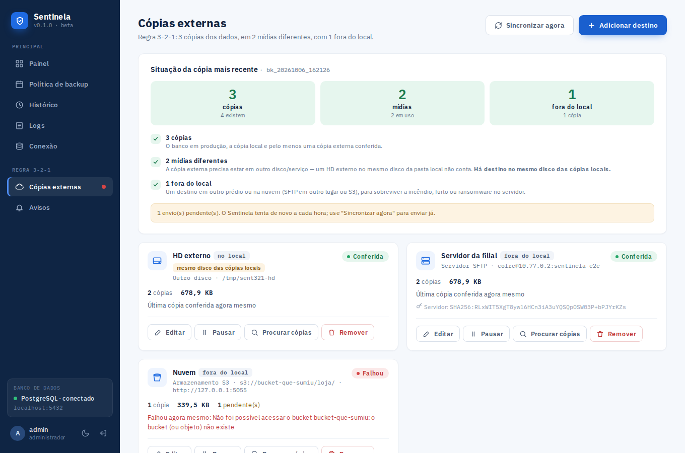
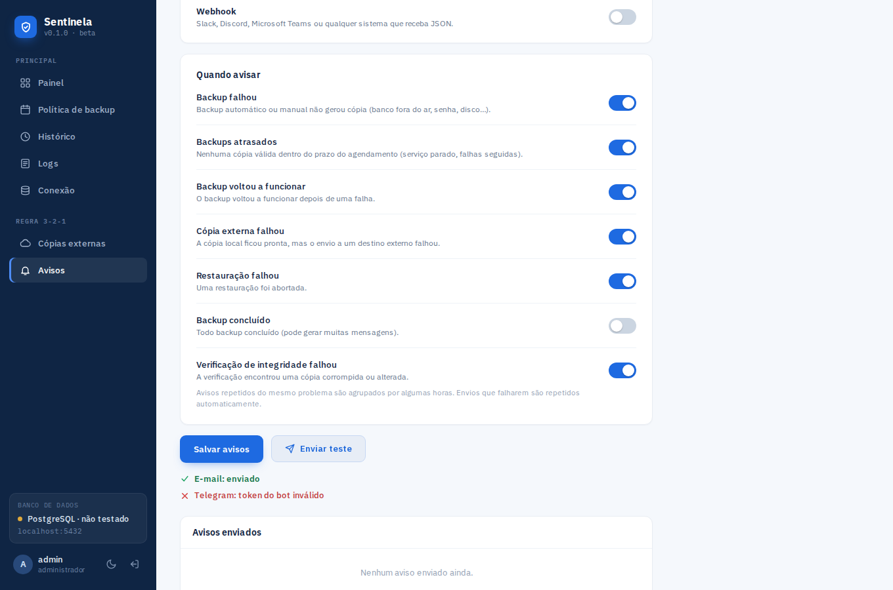
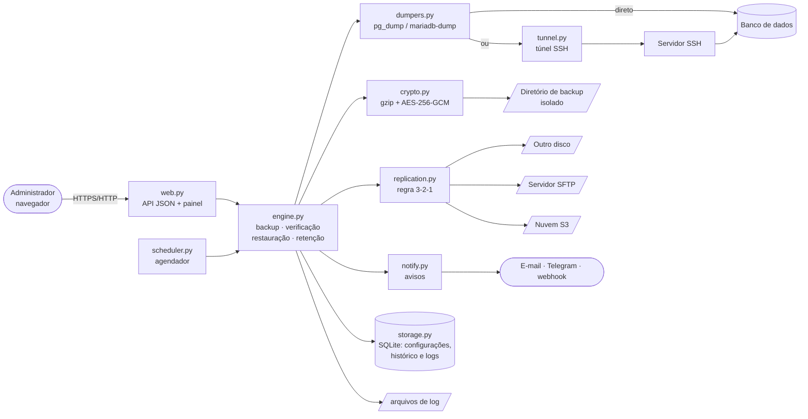
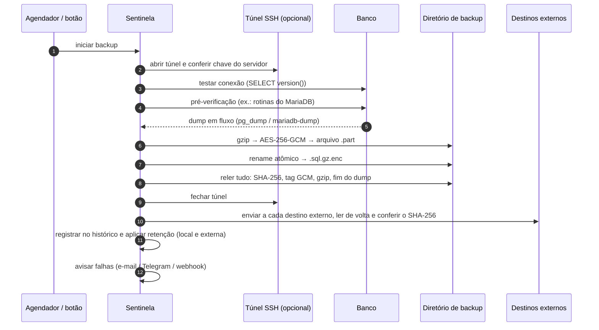
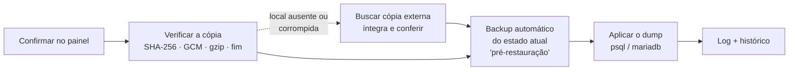
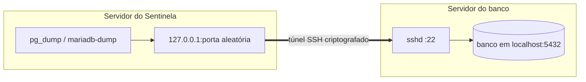
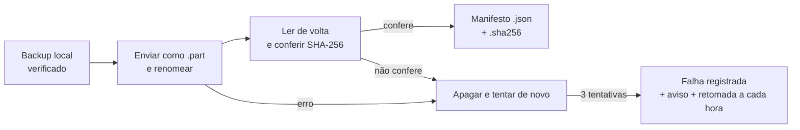

# Sentinela — Backup Automatizado

**Sistema open source de backup automatizado para pequenas empresas que usam bancos de dados
relacionais — PostgreSQL e MariaDB/MySQL — locais ou em outro servidor, via túnel SSH — com cópias
externas conferidas (regra 3-2-1) e aviso imediato de falha por e-mail, Telegram ou webhook.**

Projeto Integrador · Curso Técnico · IFSC Câmpus São Lourenço do Oeste · 2026
Autor: **Kauan V. Machado Deon** · Licença MIT


---

## Sumário

1. [Por que o Sentinela existe](#1-por-que-o-sentinela-existe)
2. [O que ele faz](#2-o-que-ele-faz)
3. [Telas](#3-telas)
4. [Como funciona por dentro](#4-como-funciona-por-dentro)
5. [Instalação](#5-instalação)
6. [Guia de uso — tela por tela](#6-guia-de-uso--tela-por-tela)
7. [Preparando o banco de dados](#7-preparando-o-banco-de-dados)
8. [Banco em outro servidor: túnel SSH](#8-banco-em-outro-servidor-túnel-ssh)
9. [Cópias externas e a regra 3-2-1](#9-cópias-externas-e-a-regra-3-2-1)
10. [Avisos de falha](#10-avisos-de-falha)
11. [Linha de comando](#11-linha-de-comando)
12. [Configuração (variáveis de ambiente)](#12-configuração-variáveis-de-ambiente)
13. [Recuperação de desastre](#13-recuperação-de-desastre)
14. [Segurança](#14-segurança)
15. [Solução de problemas](#15-solução-de-problemas)
16. [Testes](#16-testes)
17. [Estrutura do código e API](#17-estrutura-do-código-e-api)
18. [Limitações conhecidas](#18-limitações-conhecidas)

---

## 1. Por que o Sentinela existe

Muitas pequenas empresas já usam sistemas informatizados, mas não têm um backup **automático,
seguro e conferido**. O problema é sério: 60% das pequenas empresas encerram as atividades em até
seis meses após uma perda grave de dados, 51% dos ataques de *ransomware* tentam destruir os
backups da vítima e cerca de 58% dos backups corporativos falham — muitas vezes sem que ninguém
perceba até a hora de restaurar (ver referências no documento do projeto).

A motivação prática veio da migração de dados entre ERPs de provedores de internet: o backup
fornecido por alguns sistemas é **incompleto** (dados visíveis na interface não aparecem no dump)
ou depende do fornecedor. O Sentinela devolve o controle ao dono dos dados: faz a cópia do banco
inteiro, protege, confere e avisa quando algo dá errado — em vez de falhar em silêncio.

## 2. O que ele faz

| Requisito do projeto | Como o Sentinela atende |
|---|---|
| Interface para configurar a política de backup | Painel web com login: Painel, Política, Histórico, Logs e Conexão |
| Agendamento automático | Diário à meia-noite **ou** a cada *N* dias (1–30), sem intervenção manual |
| Retenção configurável (máx. 10 dias) | Exclusão automática das cópias expiradas (1–10 dias). A cópia válida mais recente nunca é apagada |
| Extração via dump — PostgreSQL e MariaDB | `pg_dump` ou `mariadb-dump`/`mysqldump`, escolhido na tela Conexão |
| Banco em outro servidor | Conexão direta **ou túnel SSH** (senha ou chave privada), com verificação da chave do servidor |
| Criptografia | **AES-256-GCM** — confidencialidade **e** detecção de adulteração |
| Compressão | **gzip**, aplicada em fluxo antes da criptografia (≈ −90% em bases típicas) |
| Armazenamento isolado (regra 3-2-1) | Pasta local isolada **+ cópias externas automáticas** em outro disco, servidor SFTP e/ou nuvem S3, cada uma relida e conferida pelo SHA-256; painel mostra se a regra 3-2-1 está atendida |
| Log detalhado a cada execução | Cada etapa com horário exato, no **terminal ao vivo** do painel e em arquivos `.log` |
| Avisar quando algo dá errado | **E-mail, Telegram e webhook** (Slack, Discord, Teams) para backup com falha, cópia externa com falha, restauração/verificação com falha e backups atrasados — com reenvio automático se o próprio aviso falhar |
| Verificação de integridade | Após **cada** backup e sob demanda: SHA-256, autenticação GCM, gzip, fim do dump e contagem de rotinas |
| Teste de restauração | Restauração pelo painel, com verificação prévia e **cópia automática do estado atual** antes de sobrescrever |

Além do escopo original:

- **Terminal de logs ao vivo** (estilo `tail -f`) com filtros, busca e progresso do dump em MB/s.
- **Painel de execução em andamento** com etapas, progresso e últimas linhas do log.
- **Checklist "Saúde da proteção"** e gráfico das últimas cópias.
- **Detecção de backup incompleto**: o `mariadb-dump` pula em silêncio rotinas que o usuário não
  enxerga; o Sentinela confere e acusa.
- **Restauração que se recupera sozinha:** se a cópia local sumiu ou foi corrompida, a restauração
  busca uma cópia externa íntegra e segue.
- **Recuperação de desastre pelo painel:** num servidor novo, "Procurar cópias" no destino reencontra
  o histórico pelos manifestos enviados junto de cada cópia.
- **Tema escuro**, layout responsivo (funciona no celular) e linha de comando para cron e recuperação.

## 3. Telas

| | |
|---|---|
|  **Backup em andamento** — etapas, progresso e log ao vivo |  **Terminal de logs** — linhas chegando em tempo real |
|  **Conexão** — direta ou via túnel SSH |  **Detalhe** — metadados, integridade, restaurar, baixar |
|  **Histórico** — filtros por tipo e falhas |  **Política** — agendamento, retenção, segurança |
|  **Cópias externas** — regra 3-2-1, destinos e falhas |  **Avisos** — e-mail, Telegram, webhook e teste de envio |
|  **Tema escuro** |  **Logs no tema escuro** |

<p align="center"></p>

---

## 4. Como funciona por dentro

### 4.1 Arquitetura



Tudo roda em **um único processo** Python: o servidor web (waitress) e, em paralelo, a thread do
agendador. Não há serviço externo além do banco que será copiado.

### 4.2 Ciclo de um backup



Cada etapa vira uma linha de log com horário. Um backup real, via SSH:

```
15:57:10  INFO  Iniciando backup manual · PostgreSQL
15:57:10  INFO  Abrindo túnel SSH para tunel@10.77.0.2:22
15:57:11  OK    Túnel SSH estabelecido · chave do host SHA256:RLxWIT5X…
15:57:11  INFO  Conectando ao banco "loja_remota" em localhost:5432 via SSH 10.77.0.2
15:57:11  OK    Conexão estabelecida · PostgreSQL 16.13
15:57:11  INFO  Gerando dump em fluxo: dump → gzip → AES-256-GCM
15:57:13  INFO  Dump em andamento: 108,0 MB · 54,0 MB/s
15:57:14  OK    Dump gerado com sucesso (136,1 MB)
15:57:14  OK    Arquivo comprimido com gzip (10,4 MB · −92,4%)
15:57:14  OK    Arquivo criptografado com AES-256-GCM
15:57:14  OK    Cópia armazenada em /backups/loja_remota_20260929_155710.sql.gz.enc
15:57:14  INFO  SHA-256 eda788e8bc617987828a7a6c746d030c6bbbb2ed7489aea14944c74a10bbee8d
15:57:14  OK    Integridade verificada: arquivo legível e dump completo
15:57:14  OK    Backup concluído em 4s
15:57:14  INFO  Regra 3-2-1: enviando para 2 destino(s) externo(s)
15:57:14  INFO  Enviando cópia para HD externo (Outro disco · /mnt/hd-externo/sentinela)
15:57:14  OK    Cópia externa em HD externo conferida (SHA-256 confere) · 10,4 MB em 1s · 98,2 MB/s
15:57:14  INFO  Enviando cópia para Nuvem (Armazenamento S3 · s3://empresa-backups/loja/ · AWS us-east-1)
15:57:17  OK    Cópia externa em Nuvem conferida (SHA-256 confere) · 10,4 MB em 3s · 3,5 MB/s
15:57:17  OK    Regra 3-2-1: 4 cópias ✓ · 3 mídias ✓ · 1 fora do local ✓
```

Pontos importantes do desenho:

- **Em fluxo (streaming):** o SQL em texto claro **nunca** é gravado em disco e bancos grandes não
  são carregados na memória. A saída do `pg_dump` passa por gzip e AES em blocos de 1 MB.
- **Gravação atômica:** o arquivo é escrito como `.part` e só depois renomeado. Um dump interrompido
  (queda de rede, banco reiniciado, disco cheio) **nunca** vira uma cópia "válida".
- **Conferência do fim do dump:** o `pg_dump` termina com `PostgreSQL database dump complete` e o
  `mariadb-dump` com `Dump completed`. Sem esse marcador, a cópia é rejeitada.

### 4.3 Formato do arquivo de backup

Nome: `<banco>_<AAAAMMDD>_<HHMMSS>.sql[.gz][.enc]` — as extensões indicam as camadas aplicadas.

Arquivo criptografado (`.enc`):

```
┌──────────┬────────┬──────────────┬─────────────────────────────┬──────────────┐
│ "SNTL"   │ versão │ nonce (12 B) │ SQL comprimido e cifrado    │ tag GCM (16) │
│ 4 bytes  │ 1 byte │ aleatório    │ AES-256-GCM                 │ autenticação │
└──────────┴────────┴──────────────┴─────────────────────────────┴──────────────┘
```

O cabeçalho entra como dado autenticado (AAD): alterar **qualquer** byte do arquivo — cabeçalho ou
conteúdo — faz a verificação falhar. Além disso, o SHA-256 do arquivo é registrado no histórico.

### 4.4 Verificação de integridade

Feita automaticamente logo após cada backup e, sob demanda, pelo botão **Verificar integridade**:

1. o arquivo existe no diretório;
2. o **SHA-256** confere com o registrado no momento da criação;
3. a **tag AES-256-GCM** é válida (arquivo íntegro e chave correta);
4. o **gzip** descomprime até o fim;
5. o SQL termina com o **marcador de dump completo**.

No MariaDB há ainda a **conferência de completude**: antes do dump o Sentinela conta as
procedures/functions do banco direto em `mysql.proc`; depois conta as que entraram na cópia.
Faltou alguma → o backup **falha** com a explicação. Se o usuário não tem permissão para fazer essa
contagem, o log e o checklist mostram um aviso com o `GRANT` necessário (ver [seção 7](#7-preparando-o-banco-de-dados)).

### 4.5 Restauração



- **Cópia local perdida ou corrompida:** o Sentinela busca a cópia nos destinos externos (o mais
  rápido primeiro: disco → SFTP → S3), confere o SHA-256, **recompõe a cópia local** e segue. Uma
  cópia externa corrompida é ignorada e marcada; se nenhuma estiver íntegra, a restauração é
  abortada sem tocar no banco.
- **PostgreSQL:** o dump é aplicado com `--single-transaction` e `ON_ERROR_STOP` — ou tudo é
  restaurado, ou nada muda.
- **MariaDB:** o cliente não restaura de forma atômica. Se algo falhar no meio, a mensagem de erro
  indica a **cópia pré-restauração** que devolve o banco ao estado anterior.
- **Objetos com dono (DEFINER) no MariaDB:** views, triggers e procedures guardam o usuário que as
  criou (ex.: `root`). Recriá-las com outro dono exigiria privilégio `SUPER`; por isso o Sentinela
  remove a cláusula `DEFINER` durante a restauração (só nos comandos de criação, nunca nos dados) e
  os objetos passam a pertencer ao usuário que restaura.

### 4.6 Agendamento e retenção

- **Diário:** todo dia à meia-noite (horário do servidor). **Intervalo:** a cada *N* dias, à meia-noite.
- Se o servidor estava desligado no horário, o backup roda assim que o Sentinela volta e o próximo
  é reagendado normalmente.
- **Uma execução por vez:** backups, restaurações e verificações nunca rodam em paralelo — nem entre
  o painel e um `sentinela backup` disparado pelo cron (trava de arquivo entre processos).
- **Retenção:** cópias mais antigas que *N* dias (1 a 10) são apagadas após cada backup e a cada hora
  — a local **e as externas**. A **cópia válida mais recente nunca é apagada**, mesmo expirada, para o
  sistema nunca ficar sem nenhum backup restaurável.
- **Manutenção de hora em hora:** retenção, reenvio das cópias externas pendentes, exclusões
  externas pendentes, reenvio de avisos que falharam e alerta de "backups atrasados".

### 4.7 Logs

| Onde | O quê |
|---|---|
| Tela **Logs** | Terminal ao vivo com todas as execuções, filtros e busca |
| Tela **Detalhe** | Log da execução daquela cópia (ao vivo enquanto roda) |
| `$SENTINELA_HOME/logs/sentinela.log` | Log geral (rotativo, 5 × 5 MB), inclusive logins e alterações |
| `$SENTINELA_HOME/logs/execucoes/*.log` | Um arquivo por execução (guardados por 90 dias) |

Níveis: `INFO` (etapa iniciada), `OK` (etapa concluída), `WARN` (atenção, mas seguiu) e `ERRO`.

---

## 5. Instalação

Escolha um dos três jeitos:

| Jeito | Para quem | Precisa instalar |
|---|---|---|
| [**Docker**](#51-docker--qualquer-sistema-o-mais-fácil) | Qualquer sistema; o mais simples de manter | Só o Docker (Docker Desktop no Windows/macOS) |
| [**Windows**](#52-windows-sem-docker) | Servidor ou PC Windows 10/11 / Server 2019+ | Python e o PostgreSQL ou MariaDB (os clientes vêm junto) |
| [**Linux**](#53-linux) | Servidor Linux | Python e os pacotes cliente do banco |

Os três são testados automaticamente a cada alteração (GitHub Actions: Ubuntu, Windows com Python
3.12 e 3.13, e a imagem Docker) — veja a [seção 16](#16-testes).

### 5.1 Docker — qualquer sistema (o mais fácil)

A imagem já traz o Python, o `pg_dump`/`psql` mais novo (funciona com servidores PostgreSQL
antigos) e o `mariadb-dump`/`mariadb`. Funciona como um "executável": um clique para iniciar.

1. Instale o **Docker Desktop** (Windows/macOS) ou o Docker Engine (Linux) e deixe-o aberto.
2. Baixe o Sentinela (botão *Code → Download ZIP* no GitHub, ou `git clone`) e extraia numa pasta.
3. **Windows:** dê dois cliques em **`iniciar.bat`**. **Linux/macOS:** `./iniciar.sh`.
4. Na primeira vez a imagem é construída (alguns minutos). O script mostra a **senha do
   `admin`** e abre `http://localhost:8080`.

| Arquivo | Para quê |
|---|---|
| `iniciar.bat` / `iniciar.sh` | Constrói (se preciso), inicia e mostra a senha do primeiro acesso |
| `parar.bat` (ou `docker compose stop`) | Para o Sentinela (as cópias e configurações ficam) |
| `trocar-senha.bat` / `trocar-senha.sh` | Troca a senha do `admin` |

Onde ficam as coisas (pastas ao lado do `docker-compose.yml`):

| Pasta | Conteúdo |
|---|---|
| `dados/` | banco do Sentinela, **chave mestra** (`sentinela.key`) e logs |
| `backups/` | cópias locais (no painel: `/backups`) |
| `externo/` | destino "Outro disco" (no painel: `/externo`) |

Dicas:

- **Banco no mesmo computador:** na tela Conexão use o host **`host.docker.internal`** (não
  `localhost`, que dentro do contêiner é o próprio contêiner). O banco precisa aceitar conexões
  da rede do Docker (no PostgreSQL: `listen_addresses` e `pg_hba.conf`).
- **Banco em outro servidor:** use o IP/nome dele, ou o túnel SSH normalmente.
- **HD externo / NAS como destino 3-2-1:** no `docker-compose.yml`, troque `./externo` pelo caminho do
  disco (ex.: `E:/SentinelaBackups:/externo` no Windows, `/mnt/hd:/externo` no Linux), rode o
  `iniciar` de novo e cadastre o destino "Outro disco" com a pasta **`/externo`**.
- **Fuso horário do agendamento:** `TZ` no `docker-compose.yml` (padrão `America/Sao_Paulo`).
- **Painel na rede:** por padrão só este computador acessa (`127.0.0.1:8080`). Para liberar, troque
  para `"8080:8080"` e publique atrás de HTTPS ([seção 5.3.3](#533-acesso-pela-rede-https)).
- **Atualizar:** baixe a versão nova por cima e rode o `iniciar` de novo (as pastas são mantidas).
- O contêiner reinicia sozinho com o Docker (`restart: unless-stopped`) e roda com usuário sem
  privilégios.

### 5.2 Windows (sem Docker)

Testado em Windows Server 2022/2025 (o mesmo do Windows 10/11) com Python 3.12 e 3.13.

1. **Python:** instale pelo [python.org](https://www.python.org/downloads/windows/) marcando
   **"Add python.exe to PATH"**.
2. **Clientes do banco:** instale o **PostgreSQL** (instalador da EDB — se o banco fica em outra
   máquina, marque só *Command Line Tools*) e/ou o **MariaDB** (MSI do mariadb.org). **Não é
   preciso mexer no PATH:** o Sentinela acha sozinho o `pg_dump`/`psql` em
   `C:\Program Files\PostgreSQL\<versão>\bin` e o `mariadb-dump`/`mariadb` em
   `C:\Program Files\MariaDB <versão>\bin` (usa a versão mais nova instalada). Em outro lugar,
   informe o caminho em `SENTINELA_PG_DUMP`, `SENTINELA_PSQL`, `SENTINELA_MYSQLDUMP`, `SENTINELA_MYSQL`.
3. **Sentinela** — no PowerShell, dentro da pasta extraída:

   ```powershell
   py -m venv .venv
   .venv\Scripts\pip install -r requirements.txt
   .venv\Scripts\python -m sentinela serve
   ```

   A janela mostra a senha do `admin`. Acesse `http://127.0.0.1:8080`. Os dados ficam em `.\data`
   e as cópias em `C:\ProgramData\Sentinela\backups` (troque no painel, ex.: `E:\Backups`).
4. **Iniciar junto com o Windows** (sem precisar de ninguém logado) — PowerShell **como
   Administrador**, na pasta do Sentinela:

   ```powershell
   powershell -ExecutionPolicy Bypass -File deploy\windows\instalar-tarefa.ps1
   ```

   Cria a tarefa agendada **Sentinela** (conta SYSTEM, reinicia se cair) com os dados em
   `C:\ProgramData\Sentinela\dados` e mostra a senha do primeiro acesso. Para trocar a senha:
   `$env:SENTINELA_HOME="C:\ProgramData\Sentinela\dados"; .venv\Scripts\python -m sentinela passwd admin`.
   Para remover: `Unregister-ScheduledTask -TaskName Sentinela -Confirm:$false`.

Particularidades do Windows (tratadas pelo Sentinela):

- **Permissões:** em vez de `chmod 700`, as pastas de dados e de cópias criadas pelo Sentinela
  têm a herança removida e ficam acessíveis só ao usuário do serviço, ao SYSTEM e aos
  Administradores (ACL via `icacls`).
- **Caminhos** podem ser `E:\Backups` ou compartilhamentos `\\nas\backups` (o usuário da tarefa
  precisa ter acesso ao compartilhamento).
- O console do Windows é configurado para UTF-8, para os acentos e símbolos dos logs.
- O agendamento usa o fuso do Windows; o PC precisa estar ligado à meia-noite (se não estiver,
  o backup roda assim que ele ligar).

### 5.3 Linux

#### 5.3.1 Requisitos

- **Linux** (testado em Ubuntu 24.04). macOS deve funcionar com os clientes do Homebrew.
- **Python 3.10+**
- **Clientes do banco** instalados na máquina do Sentinela:

| SGBD | Pacote (Debian/Ubuntu) | Comandos usados |
|---|---|---|
| PostgreSQL | `postgresql-client` | `pg_dump`, `psql` |
| MariaDB/MySQL | `mariadb-client` | `mariadb-dump`, `mariadb` (ou `mysqldump`, `mysql`) |

> A versão do `pg_dump` deve ser **igual ou mais nova** que a do servidor PostgreSQL. Use o
> repositório oficial (apt.postgresql.org) se a versão da distribuição for antiga.

#### 5.3.2 Passo a passo

```bash
# 1. dependências do sistema
sudo apt install python3 python3-venv postgresql-client mariadb-client

# 2. código e ambiente Python
sudo git clone https://github.com/kauandeon-dev/Sentinela.git /opt/sentinela
cd /opt/sentinela
sudo python3 -m venv .venv
sudo .venv/bin/pip install -r requirements.txt

# 3. usuário do sistema e pastas (dados da aplicação separados das cópias)
sudo useradd --system --home /var/lib/sentinela --shell /usr/sbin/nologin sentinela
sudo install -d -o sentinela -g sentinela -m 700 /var/lib/sentinela /var/backups/sentinela

# 4. primeiro início (mostra a senha inicial do usuário admin)
sudo -u sentinela SENTINELA_HOME=/var/lib/sentinela SENTINELA_BACKUP_DIR=/var/backups/sentinela \
     .venv/bin/python -m sentinela serve
```

Saída do primeiro início:

```
============================================================
 Primeiro acesso: usuário 'admin'  senha: 0EJ0QRHiF_L9VSgi
 Altere com: python -m sentinela passwd admin
============================================================
 Chave mestra: /var/lib/sentinela/sentinela.key
  -> guarde uma cópia FORA do servidor; sem ela as cópias
     criptografadas não podem ser recuperadas.
```

Acesse `http://127.0.0.1:8080` e siga o [guia de uso](#6-guia-de-uso--tela-por-tela).

#### Como serviço (systemd)

```bash
sudo cp deploy/sentinela.service /etc/systemd/system/
sudo systemctl daemon-reload
sudo systemctl enable --now sentinela
journalctl -u sentinela -f          # acompanhar
```

O arquivo [`deploy/sentinela.service`](deploy/sentinela.service) já vem com as pastas acima e
endurecimento (`ProtectSystem=strict`, `NoNewPrivileges`, `UMask=0077`). Se o diretório de backup
for outro (ex.: um disco externo), inclua-o em `ReadWritePaths`.

#### 5.3.3 Acesso pela rede (HTTPS)

O painel escuta só em `127.0.0.1`. Para acessar de outra máquina, publique atrás de um proxy com
HTTPS e defina `SENTINELA_HTTPS=1`: o cookie de sessão passa a ser só HTTPS e o Sentinela confia no
cabeçalho `X-Forwarded-For` do proxy (para o bloqueio de login valer por IP real). Exemplo com nginx:

```nginx
server {
    listen 443 ssl;
    server_name backup.suaempresa.com.br;
    ssl_certificate     /etc/letsencrypt/live/backup.suaempresa.com.br/fullchain.pem;
    ssl_certificate_key /etc/letsencrypt/live/backup.suaempresa.com.br/privkey.pem;
    location / {
        proxy_pass http://127.0.0.1:8080;
        proxy_set_header X-Forwarded-For   $remote_addr;
        proxy_set_header X-Forwarded-Proto $scheme;
    }
}
```

---

## 6. Guia de uso — tela por tela

### 6.1 Entrar


Use o usuário `admin` e a senha mostrada no primeiro início. Para trocar a senha (ou criar outro
usuário): `python -m sentinela passwd admin`. Após 5 tentativas erradas o login é bloqueado por 60 s.

### 6.2 Conexão — configure primeiro

1. **Gerenciador (SGBD):** PostgreSQL ou MariaDB (MySQL). A porta padrão muda sozinha (5432/3306).
2. **Forma de acesso:**
   - **Conexão direta** — o Sentinela alcança a porta do banco pela rede.
   - **Túnel SSH** — o banco está em outro servidor e só o SSH é acessível. Veja a [seção 8](#8-banco-em-outro-servidor-túnel-ssh).
3. **Banco de dados:** host, porta, nome do banco, usuário e senha. Com túnel SSH, o host é o
   endereço do banco **visto pelo servidor SSH** (quase sempre `localhost`).
4. **Testar conexão:** mostra a versão do banco ou o motivo exato da falha.
5. **Diretório de backup:** pasta onde as cópias ficam (fora da pasta da aplicação).
6. **Salvar configurações.** Senhas e chaves já salvas aparecem como "•••••••• (mantida)"; deixe o
   campo vazio para mantê-las.

### 6.3 Política de backup

- **Agendamento:** *Diário à meia-noite* ou *Intervalo personalizado* (a cada 1–30 dias).
- **Retenção:** 1 a 10 dias.
- **Diretório de armazenamento:** o mesmo da tela Conexão — a cópia local. As cópias em outro disco
  e fora do local (regra 3-2-1) são configuradas em **Cópias externas** ([seção 9](#9-cópias-externas-e-a-regra-3-2-1)).
- **Criptografia (AES-256)** e **Compressão (gzip)**: ligadas por padrão. Desligar a criptografia
  deixa as cópias legíveis por qualquer um com acesso à pasta — o checklist passa a acusar isso.

### 6.4 Painel

- **Indicadores:** status do agendamento, próximo backup, último backup e retenção.
- **Execução em andamento:** aparece durante qualquer backup, verificação ou restauração, com as
  etapas (Conexão → Dump · gzip · AES → Verificação → Concluído), o volume processado, o tempo
  decorrido e as últimas linhas do log.
- **Alerta amarelo:** existe backup com falha entre as cópias guardadas; *Ver logs* abre o detalhe.
- **Últimas execuções:** gráfico com o tamanho de cada cópia; barras vermelhas são falhas. Clique
  numa barra para abrir a cópia.
- **Regra 3-2-1:** quantas cópias, mídias e cópias fora do local existem para o último backup, e a
  situação de cada destino. Um destino falhando gera alerta no topo e um ponto vermelho no menu.
- **Saúde da proteção:** checklist com a situação atual (cópia recente, integridade, criptografia,
  compressão, túnel SSH, espaço em disco, permissões do usuário de backup, regra 3-2-1, avisos
  configurados e chave mestra exportada).
- **Fazer backup agora:** backup manual imediato.

### 6.5 Histórico e detalhe da cópia

O **Histórico** lista as cópias guardadas, com abas *Todos*, *Automáticos*, *Manuais* e *Falhas*.
Clique numa linha para abrir o **detalhe**:

- **Metadados:** tipo, SGBD, banco, tamanho (e tamanho do SQL original), duração, proteção,
  integridade, SHA-256 (com botão copiar) e caminho do arquivo.
- **Restaurar este backup:** substitui o banco atual pela cópia (com confirmação). Antes, o Sentinela
  verifica a cópia e faz um backup do estado atual. Você é levado ao terminal para acompanhar.
- **Verificar integridade:** relê a cópia por completo (seção 4.4).
- **Baixar cópia:** baixa o arquivo como está (criptografado). Para lê-lo fora do painel, use
  `python -m sentinela decrypt`.
- **Trazer para o servidor:** aparece quando a cópia não está mais no disco local, mas existe num
  destino externo.
- **Excluir cópia:** apaga o arquivo do diretório **e as cópias externas** dela.
- **Cópias externas:** cada destino que recebeu a cópia, onde ela está, se foi conferida e erros.
- **Log desta execução:** todas as linhas daquele backup.

No histórico, `+2 ext` indica em quantos destinos externos a cópia está conferida.

### 6.6 Logs — o terminal

- As linhas chegam **ao vivo** (selo "ao vivo" e cursor piscando enquanto algo executa).
- **Seguir novas linhas:** mantém o terminal no fim. Se você rolar para cima para ler algo, ele pausa
  sozinho; volte ao fim para retomar.
- **Filtros:** por nível (INFO, OK, WARN, ERRO) e por tipo (backups, restaurações, verificações,
  cópias externas).
- **Busca:** destaca o termo em todas as linhas. Atalho: tecla **/**.
- Clique no cabeçalho de uma execução para **recolher/expandir**; o link leva à cópia.
- **Copiar:** copia o que está visível (respeitando filtros). **Baixar logs:** baixa o `sentinela.log`.

### 6.7 Tema escuro

Ícone de lua/sol na barra lateral (e no login). Na primeira visita o painel segue o tema do sistema
operacional; depois, lembra a escolha no navegador.

---

## 7. Preparando o banco de dados

Crie um usuário próprio para o backup. Permissões **testadas** com o Sentinela:

### PostgreSQL

```sql
-- somente backup (leitura de tudo) — PostgreSQL 14+
CREATE ROLE backup_user LOGIN PASSWORD 'troque-esta-senha';
GRANT CONNECT ON DATABASE loja TO backup_user;
GRANT pg_read_all_data TO backup_user;
```

Para **restaurar**, use o **dono do banco** (ou um usuário com os mesmos privilégios): a restauração
apaga e recria os objetos. Sem permissão de leitura em alguma tabela, o `pg_dump` falha com
`permission denied` — o backup **nunca** sai incompleto em silêncio.

### MariaDB / MySQL

```sql
CREATE USER 'backup_user'@'localhost' IDENTIFIED BY 'troque-esta-senha';
GRANT SELECT, SHOW VIEW, TRIGGER, LOCK TABLES, EVENT ON loja.* TO 'backup_user'@'localhost';
-- para conferir/copiar procedures e functions criadas por outros usuários:
GRANT SELECT ON mysql.proc TO 'backup_user'@'localhost';
-- para também RESTAURAR pelo painel:
GRANT ALL ON loja.* TO 'backup_user'@'localhost';
```

> **Atenção (MariaDB):** sem `SELECT ON mysql.proc`, o `mariadb-dump` **omite em silêncio** as
> procedures/functions que o usuário não consegue ver — termina "com sucesso" e a cópia fica
> incompleta. O Sentinela detecta a falta dessa permissão e avisa no log e no checklist.
>
> **MySQL 8:** não existe `mysql.proc`, então a conferência de rotinas não é feita. Conceda
> `GRANT SHOW_ROUTINE ON *.* TO 'backup_user'@'localhost'` para que o dump inclua todas elas.

> Com túnel SSH, o banco enxerga a conexão como vinda do **próprio servidor** (`localhost` ou
> `127.0.0.1`). Crie o usuário para esses hosts.

---

## 8. Banco em outro servidor: túnel SSH



Use quando o banco está em outro servidor e **a porta do banco não deve ficar exposta**. Só a porta
do SSH precisa estar acessível.

**Como funciona**

- A cada execução o Sentinela abre uma conexão SSH, cria uma porta local temporária
  (`127.0.0.1:<aleatória>`) que encaminha até o banco e fecha tudo ao terminar.
- O dump roda na máquina do Sentinela; as cópias ficam nela.
- **Chave do servidor (TOFU):** na primeira conexão a impressão digital do servidor SSH
  (`SHA256:…`) é registrada e exibida na tela Conexão. Se mudar depois, backups e restaurações são
  **bloqueados** (possível *man-in-the-middle* ou servidor reinstalado) até você conferir e clicar em
  **redefinir**.
- **Queda de rede:** se a conexão cair no meio do dump — inclusive quedas silenciosas, sem aviso — o
  backup falha em no máximo ~60 s com a mensagem "a conexão SSH caiu durante a transferência" e
  nenhuma cópia parcial é guardada.
- Senha SSH, chave privada e senha da chave ficam **criptografadas** no Sentinela e nunca voltam
  pela API.

**Configurando (tela Conexão → Túnel SSH)**

| Campo | Exemplo |
|---|---|
| Servidor SSH / Porta | `200.100.50.10` / `22` |
| Usuário SSH | `backup` |
| Autenticação | Senha **ou** chave privada (OpenSSH ou PEM: ed25519, RSA, ECDSA; senha da chave opcional) |
| Host / Porta do banco | `localhost` / `5432` — como o **servidor SSH** enxerga o banco |

Chaves PuTTY (`.ppk`) não são aceitas: no PuTTYgen, use *Conversions → Export OpenSSH key*.

**Recomendado no servidor do banco** — um usuário só para o túnel, sem shell, com chave:

```bash
# na máquina do Sentinela: gerar a chave
ssh-keygen -t ed25519 -f sentinela_tunel -C sentinela

# no servidor do banco: usuário dedicado
sudo useradd -m -s /usr/sbin/nologin backup
sudo install -d -m 700 -o backup -g backup /home/backup/.ssh
# em /home/backup/.ssh/authorized_keys, uma linha (a chave só abre túnel até o PostgreSQL):
restrict,port-forwarding,permitopen="localhost:5432" ssh-ed25519 AAAA...conteúdo de sentinela_tunel.pub
```

Cole o conteúdo de `sentinela_tunel` (a chave **privada**) no campo *Chave privada*. O servidor SSH
precisa permitir encaminhamento (`AllowTcpForwarding yes`, padrão do OpenSSH).

---

## 9. Cópias externas e a regra 3-2-1


A regra 3-2-1 é o padrão mínimo de proteção recomendado:

| | Significa | Como o Sentinela confere |
|---|---|---|
| **3** cópias | os dados em produção + 2 cópias de backup | banco + cópia local + ≥ 1 cópia externa **conferida** |
| **2** mídias | as cópias não podem estar no mesmo disco | mídias diferentes entre a pasta local e os destinos (um "HD externo" que na verdade está no mesmo disco é detectado e **não conta**) |
| **1** fora do local | sobreviver a incêndio, furto, ransomware no servidor | destino marcado como *fora do local* (por padrão SFTP e S3) |

O painel mostra os três números para o backup mais recente e se a regra está **Atendida**.

### 9.1 Tipos de destino

| Tipo | Para quê | O que informar |
|---|---|---|
| **Outro disco** | HD externo USB, segundo disco, NAS montado por NFS/SMB | pasta (precisa ser fora da pasta local e da aplicação) |
| **Servidor SFTP** | outro servidor/filial, um VPS, um NAS com SSH | servidor, porta, usuário, senha **ou** chave privada, pasta remota |
| **Armazenamento S3** | nuvem: AWS S3, Backblaze B2, Wasabi, Cloudflare R2, MinIO… | bucket, prefixo, endpoint (vazio = AWS), região, Access Key, Secret Key |

Na tela **Cópias externas → Adicionar destino**, escolha o tipo, preencha e use **Testar destino**:
o Sentinela grava, lê de volta e apaga um arquivo de teste — se passar, o destino funciona.
Senhas, chaves privadas e Secret Keys ficam cifradas e nunca voltam pela API. No SFTP, a impressão
digital do servidor é registrada na primeira conexão; se mudar, os envios são bloqueados (como no
túnel SSH).

> **Dica de segurança para a nuvem:** crie uma chave de acesso com permissão **só no bucket** do
> Sentinela e, se o serviço oferecer, ligue o *versionamento*/*object lock* do bucket — assim nem um
> invasor com acesso ao servidor consegue apagar as cópias antigas.

### 9.2 Como cada cópia é enviada



- **Atômico:** o arquivo só aparece com o nome final depois de completo (no S3, o upload já é atômico).
- **Conferido:** cada cópia é **lida de volta** e comparada pelo SHA-256. Transferência corrompida
  é apagada e reenviada.
- **Três tentativas** por destino (esperas de 5 s e 20 s). Persistindo a falha, a cópia local
  continua válida, o destino aparece como *Falhou*, você recebe um aviso e o Sentinela **retoma o
  envio a cada hora** até conseguir (ou use **Sincronizar agora**).
- Junto de cada cópia vão `ARQUIVO.json` (metadados: banco, data, SHA-256, chave usada) e
  `ARQUIVO.sha256` (confira à mão com `sha256sum -c`).
- **Retenção** apaga também as cópias externas. Se o destino estiver fora do ar, a exclusão fica
  pendente e é refeita depois.
- Remover um destino **não apaga** as cópias que já estão lá. **Pausar** suspende os envios.
- Um destino novo recebe as cópias já existentes na próxima sincronização.

### 9.3 Mensagens de erro dos destinos

| Mensagem | O que fazer |
|---|---|
| `…: disco cheio` / `…chegou incompleto no servidor SFTP (disco cheio ou cota excedida?)` | Libere espaço ou reduza a retenção |
| `…: o volume está montado somente leitura` / `caminho não encontrado (o disco está montado?)` | Monte o disco externo; confira `/etc/fstab` |
| `…: permissão negada no servidor SFTP (…)` | Dê permissão de escrita ao usuário SFTP na pasta |
| `Não foi possível conectar ao servidor SFTP …: conexão recusada` | Servidor desligado, porta errada ou firewall |
| `A chave do servidor SSH mudou …` | Confirme com o administrador; depois **redefinir** em Editar destino |
| `…: o bucket (ou objeto) não existe` | Confira o nome do bucket e a região/endpoint |
| `…: acesso negado` / `chave secreta (Secret Key) incorreta` | Confira as credenciais e as permissões da chave |
| `…: não foi possível conectar ao endpoint` | Sem internet ou endpoint errado — o envio é retomado a cada hora |

---

## 10. Avisos de falha


Uma falha à meia-noite não pode esperar alguém abrir o painel. Na tela **Avisos**, ligue um ou mais
canais:

| Canal | Configuração |
|---|---|
| **E-mail** | servidor SMTP, porta, segurança (STARTTLS 587, SSL/TLS 465 ou nenhuma), usuário, senha, destinatários. No Gmail/Outlook use uma *senha de app*. |
| **Telegram** | token do bot (criado no @BotFather) e o `chat_id` — envie `/start` ao bot e veja o id em `https://api.telegram.org/bot<token>/getUpdates`. Funciona em grupos. |
| **Webhook** | URL + formato: JSON genérico, Slack, Discord ou Microsoft Teams. |

**Enviar teste** manda uma mensagem por cada canal e mostra o resultado de cada um (ex.:
`Telegram: token do bot inválido`) — sem precisar salvar antes.

**Quando avisar** (cada evento pode ser ligado/desligado):

| Evento | Padrão | Exemplo de conteúdo |
|---|---|---|
| Backup falhou | ligado | banco, servidor, erro exato, **última cópia válida** (ou alerta de que não há nenhuma) |
| Cópia externa falhou | ligado | destino, cópia, erro — a cópia local está íntegra |
| Restauração falhou | ligado | cópia, destino, erro |
| Verificação de integridade falhou | ligado | quais cópias (local/externas) não conferem |
| Backups atrasados | ligado | nenhuma cópia válida dentro do prazo do agendamento (serviço parado, falhas seguidas) |
| Backup voltou a funcionar | ligado | enviado no primeiro sucesso depois de uma falha |
| Backup concluído | desligado | todo backup (pode gerar muitas mensagens) |

Comportamento:

- O aviso **nunca** atrapalha o backup: cada canal tem tempo-limite e o resultado vai para o log da
  execução (`OK Aviso enviado por E-mail para …` ou `WARN Falha ao enviar aviso por …`).
- Um canal falhando não impede os outros.
- Aviso que falhou (servidor de e-mail fora, sem internet) é **reenviado** automaticamente na
  manutenção de hora em hora (até 3 vezes em 24 h).
- O mesmo problema repetido (ex.: destino fora do ar a cada retomada) gera **um** aviso a cada 6 h,
  não um por hora.
- Os últimos avisos e o resultado de cada envio aparecem na própria tela.

---

## 11. Linha de comando

```bash
python -m sentinela serve [--host H --port P]   # painel web + agendador
python -m sentinela passwd [usuario]             # cria usuário ou troca senha do painel
python -m sentinela backup                       # backup imediato (cron/scripts); código 0 = sucesso
python -m sentinela decrypt ARQUIVO -o SAIDA.sql [--key CHAVE]   # recupera o SQL sem o painel
python -m sentinela sync                         # envia aos destinos externos o que estiver pendente
python -m sentinela key export -o ARQUIVO.key    # exporta a chave mestra (guarde fora do servidor)
python -m sentinela key import ARQUIVO.key       # importa a chave de outra instalação (cópias antigas)
python -m sentinela key id                       # identificador da chave atual
python -m sentinela --version
```

Todos usam a mesma configuração do painel (`SENTINELA_HOME`). Exemplo de cron com uma cópia extra
ao meio-dia:

```cron
0 12 * * *  sentinela  cd /opt/sentinela && SENTINELA_HOME=/var/lib/sentinela .venv/bin/python -m sentinela backup
```

Se o painel já estiver executando algo, o comando termina com
`Backup não iniciado: Outro processo do Sentinela está executando…` (código ≠ 0).

---

## 12. Configuração (variáveis de ambiente)

| Variável | Padrão | Para quê |
|---|---|---|
| `SENTINELA_HOME` | `./data` | Dados da aplicação: `sentinela.db`, `sentinela.key`, `logs/` |
| `SENTINELA_BACKUP_DIR` | `/var/backups/sentinela` | Diretório padrão das cópias (alterável no painel) |
| `SENTINELA_BIND` | `127.0.0.1` | Endereço em que o painel escuta |
| `SENTINELA_PORT` | `8080` | Porta do painel |
| `SENTINELA_HTTPS` | — | `1` quando publicado atrás de proxy HTTPS (cookie *Secure* e IP real via `X-Forwarded-For`) |
| `SENTINELA_CONNECT_TIMEOUT` | `30` | Tempo máximo (s) para conectar ao banco e ao SSH |
| `SENTINELA_TICK` | `30` | Intervalo (s) de verificação do agendador |
| `SENTINELA_NET_TIMEOUT` | `20` | Tempo-limite (s) de rede dos destinos externos e dos avisos |
| `SENTINELA_REPLICA_ATTEMPTS` | `3` | Tentativas por destino em cada envio |
| `SENTINELA_REPLICA_BACKOFF` | `5,20` | Esperas (s) entre as tentativas |
| `SENTINELA_TELEGRAM_API` | `https://api.telegram.org` | Endereço da API do Telegram (útil atrás de proxy) |
| `SENTINELA_PG_DUMP`, `SENTINELA_PSQL` | no `PATH` | Caminho de uma versão específica dos clientes PostgreSQL |
| `SENTINELA_MYSQLDUMP`, `SENTINELA_MYSQL` | no `PATH` | Caminho dos clientes MariaDB/MySQL |

Organização em disco:

```
$SENTINELA_HOME/                  (0700 — só o usuário do serviço)
├── sentinela.db                  configurações, usuários, histórico, logs
├── sentinela.key                 chave mestra AES-256 (0600) — FAÇA UMA CÓPIA FORA DO SERVIDOR
├── sentinela.lock                trava de execução entre processos
├── chaves/                       chaves mestras importadas de outras instalações
└── logs/
    ├── sentinela.log             log geral (rotativo)
    └── execucoes/                um .log por execução

$SENTINELA_BACKUP_DIR/            (0700)
└── loja_20260929_000000.sql.gz.enc   (0600)

cada destino externo (pasta, pasta SFTP ou prefixo S3)
├── loja_20260929_000000.sql.gz.enc
├── loja_20260929_000000.sql.gz.enc.json     manifesto (metadados, SHA-256, id da chave)
└── loja_20260929_000000.sql.gz.enc.sha256   para conferir com sha256sum -c
```

---

## 13. Recuperação de desastre

### 13.1 Pelo painel (recomendado)

**Cenário: o servidor do Sentinela foi perdido.** Com a **chave mestra exportada** (tela Cópias
externas → *Baixar chave mestra*, ou `python -m sentinela key export`) e um destino externo:

1. Instale o Sentinela num servidor novo (seção 5) e configure a **Conexão** com o banco.
2. Importe a chave antiga: `python -m sentinela key import sentinela-XXXX.key`. Ela vai para um
   chaveiro — **não substitui** a chave nova; o Sentinela escolhe a chave certa de cada cópia pelo id
   gravado no manifesto.
3. Em **Cópias externas**, cadastre o mesmo destino (SFTP, S3 ou disco) e clique em **Procurar
   cópias**: as cópias encontradas entram no histórico, marcadas como *importada*.
4. Abra a cópia desejada e clique em **Restaurar**: ela é baixada do destino, conferida e aplicada.

Se faltar a chave, a restauração para com `Esta cópia foi criptografada com outra chave mestra (id …)`
e a busca avisa quais ids faltam. Cópias importadas **não** são apagadas pela retenção automática.

### 13.2 Sem o painel

Com a **chave mestra** guardada e **uma cópia** (do disco externo, por exemplo), o banco volta —
mesmo sem o painel:

```bash
# 1. recuperar o SQL (confere a autenticação GCM e o gzip no caminho)
python -m sentinela decrypt loja_20260929_000000.sql.gz.enc -o loja.sql --key sentinela.key

# 2a. PostgreSQL
psql -h servidor -U dono_do_banco -d loja -v ON_ERROR_STOP=1 --single-transaction -f loja.sql

# 2b. MariaDB
mariadb -h servidor -u usuario -p loja < loja.sql
```

Sem Python à mão? Cópias **sem** criptografia (`.sql.gz`) abrem com `gunzip`. Cópias
criptografadas exigem o Sentinela (ou qualquer implementação de AES-256-GCM seguindo o formato da
seção 4.3) **e a chave**.

> **Sem a chave mestra não há recuperação** das cópias criptografadas — nem das externas. Guarde-a
> em um cofre de senhas ou mídia separada, **longe das cópias** (quem tiver as duas coisas lê os
> dados). O checklist do painel acusa enquanto a chave nunca tiver sido exportada.

---

## 14. Segurança

- **Cópias:** AES-256-GCM com nonce aleatório por arquivo; chave mestra separada do diretório de
  backups (quem obtém só as cópias não as lê); permissões 0600/0700; SHA-256 registrado.
- **Segredos:** senhas do banco e do SSH e chave privada SSH guardadas cifradas (AES-GCM com subchave
  derivada da chave mestra); nunca retornam pela API nem aparecem no banco SQLite em texto claro.
- **MariaDB:** a senha é passada ao cliente por arquivo temporário 0600 — não aparece no `ps`.
- **SSH:** verificação da chave do servidor (TOFU com bloqueio em caso de troca); porta local do
  túnel só em `127.0.0.1`, fechada ao fim de cada execução.
- **Cópias externas:** saem **já criptografadas** (o destino nunca vê os dados); credenciais SFTP/S3
  e tokens de aviso cifrados como as demais senhas; SFTP com a mesma fixação da chave do servidor.
- **Chave mestra:** exportação pelo painel exige a senha do usuário e fica registrada no log.
- **Painel:** senhas com hash (werkzeug/scrypt); bloqueio após 5 tentativas; sessão com cookie
  `HttpOnly` + `SameSite=Strict` (e `Secure` com HTTPS) de 8 h; CSP sem scripts inline;
  `X-Frame-Options: DENY`; sem cache nas respostas da API.
- **Execução:** gravação atômica; cópia só vira "válida" depois de relida por completo; restauração
  sempre precedida de verificação e de cópia do estado atual.

---

## 15. Solução de problemas

| Mensagem | Causa provável | O que fazer |
|---|---|---|
| `Falha na autenticação SSH (usuário, senha ou chave incorretos)` | Credencial SSH errada ou chave não autorizada | Confira usuário/senha; a chave pública precisa estar no `authorized_keys` do servidor |
| `Não foi possível conectar ao servidor SSH …: tempo esgotado` | Servidor desligado, IP errado ou firewall | Teste `ssh usuario@servidor` a partir da máquina do Sentinela |
| `…nome não encontrado (host)` | DNS não resolve o nome do servidor | Use o IP ou corrija o DNS |
| `o servidor SSH não conseguiu conectar em localhost:5432 …` | Banco parado ou host/porta errados **do ponto de vista do servidor SSH** | No servidor, rode `ss -ltn` e confira onde o banco escuta |
| `o servidor SSH não permite encaminhamento para …` | `AllowTcpForwarding no` ou `permitopen` restritivo | Libere o encaminhamento para o host/porta do banco |
| `A chave do servidor SSH mudou …` | Servidor reinstalado ou possível ataque | Confirme com o administrador; depois **redefinir** na tela Conexão |
| `a conexão SSH caiu durante a transferência …` | Rede instável ou SSH reiniciado no meio | O próximo backup tenta de novo; nenhuma cópia parcial é guardada |
| `A chave privada está protegida: informe a senha da chave` | Chave com senha | Preencha *Senha da chave* |
| `Senha da chave incorreta (ou chave corrompida)` | Senha da chave errada | Confira a senha; teste com `ssh-keygen -y -f chave` |
| `Essa é a chave pública (.pub)…` | Chave pública colada | Cole o arquivo **sem** `.pub` |
| `password authentication failed` | Senha do banco errada | Corrija na tela Conexão |
| `…insufficient privileges to SHOW CREATE… — dica: …` | Rotina de outro usuário no MariaDB | `GRANT SELECT ON mysql.proc …` (seção 7) |
| `Dump incompleto: o banco tem N procedure(s)/function(s), mas só M …` | Usuário não enxerga todas as rotinas | `GRANT SELECT ON mysql.proc …` |
| `permission denied for table …` (PostgreSQL) | Usuário sem leitura em alguma tabela | `GRANT pg_read_all_data TO …` |
| `Cliente 'pg_dump' não encontrado no servidor` | Cliente do banco não instalado | `apt install postgresql-client` / `mariadb-client` |
| `server version mismatch` (pg_dump) | `pg_dump` mais antigo que o servidor | Instale a versão do PGDG ou aponte `SENTINELA_PG_DUMP` |
| `O diretório de backup deve ficar isolado da aplicação` | Pasta dentro da aplicação ou do `SENTINELA_HOME` | Escolha outra pasta (idealmente outro disco) |
| `Hash SHA-256 diferente do registrado — arquivo alterado` | A cópia foi modificada ou corrompida no disco | Não use essa cópia; restaure outra e investigue o disco |
| `Já existe uma execução em andamento` | Outro backup/restauração rodando | Aguarde terminar (acompanhe em Logs) |
| Erros de destino externo | ver [seção 9.3](#93-mensagens-de-erro-dos-destinos) | |
| `usuário ou senha do SMTP incorretos` | Senha errada ou conta exige senha de app | Gere uma senha de app no Gmail/Outlook |
| `o servidor SMTP não oferece STARTTLS` | Servidor só aceita SSL ou texto puro | Escolha SSL/TLS (465) ou *Nenhuma* |
| `token do bot inválido` / `chat não encontrado` | Token errado / bot nunca recebeu mensagem | Confira com o @BotFather; envie `/start` ao bot |
| `o webhook respondeu HTTP 4xx/5xx` | URL errada ou serviço recusou | Teste a URL; confira o formato escolhido |

---

## 16. Testes

```bash
pip install -r requirements-dev.txt       # pytest, moto (S3 falso) e aiosmtpd (SMTP falso)
python -m pytest -q tests                 # 136 testes
```

Os testes de integração usam **bancos e servidores SSH reais**. Sem eles, são ignorados
automaticamente (os unitários continuam rodando).

| Arquivo | Cobre |
|---|---|
| `test_crypto.py` | Criptografia em fluxo, adulteração, chave errada, arquivo truncado, segredos |
| `test_engine.py` | Backup PG nas 4 combinações de proteção, adulteração, restauração PG e MariaDB, retenção, CLI `decrypt` |
| `test_web.py` | Login e bloqueio, segredos fora da API, fluxo completo, **logs ao vivo** (`/api/logs/tail`), checklist |
| `test_ssh.py` | Túnel até um sshd local (senha, chave, chave protegida, troca da chave do host) |
| `test_ssh_remote.py` | **Servidor remoto isolado** (abaixo): 56 cenários |
| `test_replication.py` | Cópias externas em disco e S3: regra 3-2-1, falhas e recuperação (abaixo) |
| `test_replication_sftp.py` | Cópias externas por SFTP contra o servidor remoto real |
| `test_notify.py` | Avisos por e-mail (SMTP real local), Telegram e webhook (APIs simuladas) |

### Cenários de falha das cópias externas e dos avisos

| # | Falha provocada | Resultado esperado (verificado) |
|---|---|---|
| 1 | Banco fora do ar | Backup falha; e-mail, Telegram e Discord recebem o erro e a situação da última cópia |
| 2 | Servidor de e-mail fora do ar | `WARN` no log, aviso guardado; ao voltar, a manutenção reenvia (uma vez só) |
| 3 | Senha do SMTP errada / STARTTLS inexistente | Mensagem clara; com a senha certa, entrega |
| 4 | Token do Telegram inválido / chat inexistente / API fora | `token do bot inválido`, `chat não encontrado`, `conexão recusada` |
| 5 | Webhook com HTTP 500 | Falha registrada; os outros canais são entregues |
| 6 | Disco externo cheio (volume de 64 KB) | 3 tentativas, sem lixo no destino, cópia local válida, aviso; liberado o espaço, a retomada envia |
| 7 | Bucket S3 inexistente / endpoint fora do ar | Erro traduzido; quando volta, a sincronização envia |
| 8 | Cópia local apagada | Restauração busca no S3/SFTP, confere, recompõe a cópia local e restaura |
| 9 | Cópia local **e** a do HD corrompidas | Verificação aponta as duas; restauração ignora o HD e usa o S3 |
| 10 | Todas as cópias ruins | Restauração abortada sem tocar no banco |
| 11 | Destino fora do ar na retenção | Exclusão pendente, refeita depois |
| 12 | Servidor perdido (instalação nova, outra chave) | "Procurar cópias" reencontra o histórico; sem a chave, erro claro; importada a chave, restaura |
| 13 | SFTP: senha errada, sem permissão, **disco remoto cheio**, porta fechada, nome inexistente, chave do servidor trocada | Mensagem específica para cada caso, cópia local sempre válida |
| 14 | SFTP: **sessão derrubada no meio** de um envio de 300 MB | Tentativa 1 falha (`a conexão com o servidor SFTP caiu`), a 2ª conclui com SHA-256 conferido |
| 15 | Mesmo problema repetido | Um aviso por intervalo (sem enxurrada) |
| 16 | Nenhuma cópia válida no prazo | Aviso "Backups atrasados" |

Além disso, um roteiro no navegador (Playwright) configurou pelo painel um HD externo, um servidor
SFTP (primeiro com senha errada) e um S3, os avisos por e-mail e Telegram (primeiro com token
errado), e provocou: destino S3 quebrado, banco fora do ar, cópia local apagada antes de restaurar e
exportação da chave com senha errada — 35 verificações, inclusive tema escuro e celular.

### Servidor remoto simulado

`tests/remote/setup.sh` (requer root) cria um **namespace de rede** Linux que se comporta como outro
servidor: IP `10.77.0.2`, `sshd` na porta 22 e PostgreSQL/MariaDB escutando **só em 127.0.0.1 lá
dentro** — a única forma de alcançá-los é pelo túnel, como numa empresa real. Também cria usuários
SSH com cenários diferentes (encaminhamento proibido, só chave, chave restrita com `permitopen`),
o usuário `cofre` para os destinos SFTP (com um volume de 256 KB para simular disco cheio) e sete
chaves de teste (ed25519, RSA OpenSSH, RSA PEM, ECDSA, com e sem senha, não autorizada).

```bash
sudo tests/remote/setup.sh      # montar
sudo python -m pytest -q tests  # rodar tudo
sudo tests/remote/teardown.sh   # desmontar (--purge apaga os dados)
```

Cenários do `test_ssh_remote.py`:

- **Autenticação:** senha; 6 formatos de chave; chave protegida sem senha; senha da chave errada;
  chave com quebras de linha do Windows ou espaços; texto inválido e PuTTY; chave pública colada;
  chave não autorizada; senha errada; usuário inexistente; servidor que só aceita chave.
- **Rede:** porta SSH fechada; host inalcançável (tempo limite); nome que não resolve; porta do banco
  fechada no servidor; senha do banco errada; encaminhamento proibido; `permitopen` restritivo;
  host do banco resolvido **pelo servidor remoto** (`db.interno`).
- **Chave do servidor:** registro da impressão digital real; troca bloqueia teste, backup e
  restauração (banco intacto); redefinição; troca de servidor limpa a chave; teste antes de salvar.
- **Dados:** PostgreSQL de ~170 MB (200 mil OS, 180 mil eventos, view, função) e MariaDB (50 mil
  `radacct`, trigger, view, procedure, acentos UTF-8) — backup, estragos variados e restauração com
  **hash de todo o conteúdo idêntico** ao original; 4 combinações de proteção; `decrypt` pela CLI.
- **Interrupções:** sessão SSH derrubada no meio do dump; conexão do banco encerrada no meio;
  **rede cortada em silêncio** (interface desligada) — sem travar, sem cópia parcial, com a causa
  certa na mensagem, e o próximo backup funciona.
- **Recursos:** 12 ciclos seguidos sem vazar threads, arquivos ou sessões SSH; porta local do túnel
  só em loopback e liberada ao fechar.
- **Completude:** rotinas conferidas; aviso quando não dá para conferir; falha quando faltam.
- **Concorrência:** backup pelo painel bloqueia `sentinela backup` em outro processo.
- **Agendador e API:** backup automático via SSH; fluxo completo pela API; mensagens de erro.

Os testes também foram repetidos várias vezes seguidas para descartar instabilidade, e o painel foi
exercitado de ponta a ponta num navegador real (Playwright): login, configuração do túnel com chave
protegida, backups, terminal ao vivo, filtros, busca, verificação, restauração, tema escuro e
layout de celular.

---

## 17. Estrutura do código e API

```
sentinela/
├── __main__.py    linha de comando (serve, passwd, backup, decrypt, sync, key)
├── engine.py      backup, verificação, restauração, retenção, logs, progresso, travas
├── replication.py cópias externas: envio conferido, retomada, exclusão, busca, importação, regra 3-2-1
├── destinations.py destinos: outro disco, SFTP (paramiko) e S3 (boto3)
├── notify.py      avisos: e-mail (SMTP), Telegram e webhook; reenvio e agrupamento
├── dumpers.py     adaptadores PostgreSQL e MariaDB, pré-verificação, dicas de permissão
├── tunnel.py      túnel SSH (paramiko): chave do host, encaminhamento, detecção de queda
├── crypto.py      AES-256-GCM em fluxo, chave mestra, segredos
├── scheduler.py   agendador (diário/intervalo) e manutenção de hora em hora
├── storage.py     SQLite
├── settings.py    caminhos e limites
├── web.py         API JSON, checklist de saúde, cabeçalhos de segurança
└── static/        painel: HTML/CSS/JS puro (sem build), fontes IBM Plex locais
tests/             unitários e integração (bancos e SSH reais) + tests/remote/ (servidor simulado)
deploy/            serviço systemd
docs/img/          capturas de tela
```

Endpoints (todos exigem sessão, exceto login):

| Método | Rota | Função |
|---|---|---|
| POST | `/api/login` · `/api/logout` | Sessão |
| GET | `/api/state` | Estado geral, execução em andamento, gráfico, checklist |
| PUT | `/api/policy` | Salvar política |
| PUT | `/api/connection` · POST `/api/connection/test` | Salvar / testar conexão (e túnel SSH) |
| GET · POST | `/api/backups` | Listar cópias / iniciar backup manual |
| GET · DELETE | `/api/backups/<id>` | Detalhe com log / excluir |
| POST | `/api/backups/<id>/verify` · `/restore` | Verificar / restaurar |
| GET | `/api/backups/<id>/download` | Baixar a cópia (criptografada) |
| GET | `/api/logs` · `/api/logs/tail?since=<id>` · `/api/logs/download` | Execuções, linhas novas (ao vivo), arquivo |
| GET | `/api/executions/<id>` | Uma execução com suas linhas |
| POST | `/api/backups/<id>/fetch` | Trazer uma cópia de um destino externo para o servidor |
| GET · POST | `/api/destinations` | Destinos com situação e regra 3-2-1 / criar destino |
| PUT · DELETE | `/api/destinations/<id>` | Editar, pausar/ativar / remover destino |
| POST | `/api/destinations/test` · `/sync` · `/<id>/import` | Testar destino / sincronizar pendentes / procurar cópias |
| GET · PUT | `/api/notifications` · POST `/api/notifications/test` | Configuração e histórico dos avisos / envio de teste |
| POST | `/api/key/export` | Baixar a chave mestra (exige a senha do usuário) |

---

## 18. Limitações conhecidas

- **Backup lógico completo** a cada execução (dump SQL). Não há backup incremental nem PITR; para
  bases muito grandes (centenas de GB) um backup físico (ex.: `pg_basebackup`) é mais adequado.
- **Um banco por instalação.** Para vários bancos, rode uma instância por banco (outro
  `SENTINELA_HOME` e outra porta).
- **Restauração do MariaDB não é atômica** (limitação do próprio cliente); a cópia pré-restauração
  cobre esse caso.
- Horários (agendamento e logs) usam o **fuso do servidor**.
- A conferência das cópias externas **lê o arquivo de volta** pela rede: em links lentos ou bases
  grandes, o envio para a nuvem leva o dobro do tempo da transferência.
- Testado em Linux, Windows e Docker. macOS deve funcionar (nativo ou Docker), mas não é testado
  automaticamente.
- No Windows, o destino "Outro disco" em compartilhamento de rede exige que a conta da tarefa
  (SYSTEM) tenha acesso a ele; prefira uma conta de serviço dedicada nesse caso.

---

<sub>Projeto Integrador — Curso Técnico · IFSC Câmpus São Lourenço do Oeste · 2026 · Licença MIT</sub>
